# SnaanGhar7

**A Real-World Bathroom Acoustic Event Dataset for Privacy-Preserving Assistive Living**

[](https://debolina-34.github.io/SnaanGhar7/)
[](paper/SnaanGhar7_paper.pdf)
[](LICENSE)
[](#dataset-availability)

Debolina Chowdhury¹, Suman Samui², Sujoy Saha¹
¹Dept. of Computer Science and Engineering, NIT Durgapur, India
²Dept. of Electronics and Communication Engineering, NIT Durgapur, India
📧 debolinarimuchowdhury@gmail.com · ssamui.ece@nitdgp.ac.in · sujoy.ju@gmail.com

🔗 **Project page:** https://debolina-34.github.io/SnaanGhar7/

---

## Overview

Acoustic sensing offers a privacy-preserving alternative to camera-based monitoring for
ambient assisted living (AAL), yet publicly available datasets for bathroom acoustic
event recognition remain scarce. **SnaanGhar7** is, to our knowledge, the first publicly
available real-world **multi-site bathroom acoustic event dataset**, purpose-built for
intelligent, privacy-preserving bathroom monitoring.

The dataset spans **seven classes** — *Flush, Shower, Bathroom Tap, Basin Tap, Door,
Walker/Crutch,* and an *Unknown Class* for background/non-target sounds — recorded across
**five real-world bathrooms** (residential, hostel, and institutional) by three
contributors. After manual annotation and sliding-window segmentation, the released
benchmark corpus contains **21,387 near-balanced audio segments** (imbalance ratio
**1.2×**). Seven baseline acoustic event classification models (MFCC- and raw-waveform-based)
are benchmarked, with the best model reaching **99.64%** offline accuracy and **89.26%**
real-time accuracy on an embedded Raspberry Pi Zero 2 W.

<p align="center">
  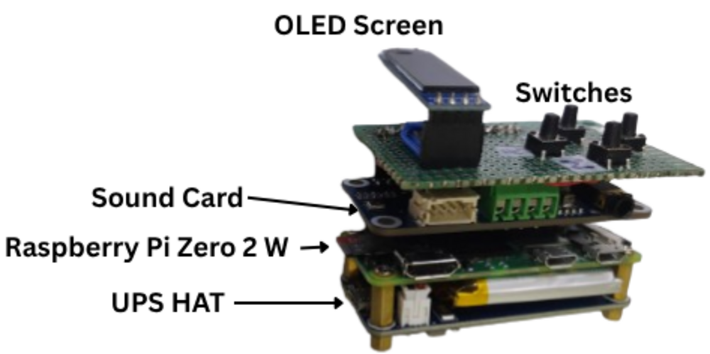
</p>

<p align="center">
  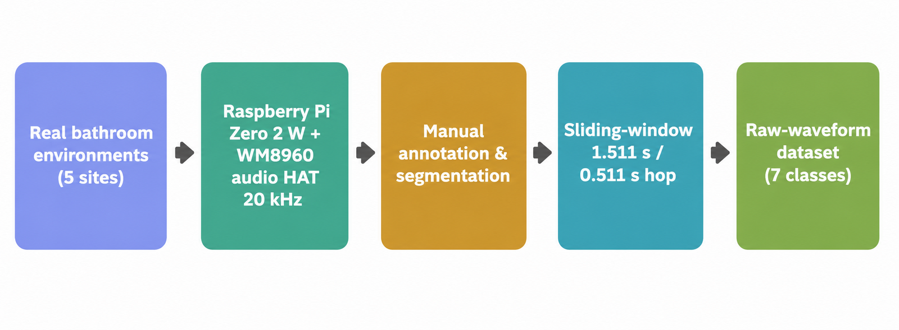
</p>

## Why SnaanGhar7?

Widely used environmental sound benchmarks — ESC-50, UrbanSound8K, AudioSet, FSD50K,
TAU Acoustic Scenes, DESED — contain few or no bathroom-specific recordings. Existing
smart-home corpora (Health Smart Home, Sweet-Home) include only limited bathroom
activity, and prior bathroom-monitoring studies rely on small proprietary datasets
collected under controlled/laboratory conditions. Bathrooms are among the most
safety-critical rooms in a home — especially for older adults and people with mobility
impairments — which makes a public, realistic, privacy-preserving benchmark valuable for
reproducible AAL and TinyML research.

| Dataset | Domain | Bathroom | Public | Benchmark | Audio |
|---|---|:---:|:---:|:---:|:---:|
| ESC-50 | Environmental Sounds | ✗ | ✓ | ✓ | ✓ |
| UrbanSound8K | Urban Sounds | ✗ | ✓ | ✓ | ✓ |
| AudioSet | General Audio Events | Partial | ✓ | ✓ | ✓ |
| FSD50K | General Audio Events | Partial | ✓ | ✓ | ✓ |
| TAU Acoustic Scenes | Acoustic Scenes | ✗ | ✓ | ✓ | ✓ |
| Health Smart Home | Smart Home ADLs | Limited | ✓ | Partial | ✓ |
| Sweet-Home | Smart Home ADLs | Limited | ✓ | Partial | ✓ |
| Bathroom Monitoring (prior studies) | Healthcare | ✓ | ✗ | ✗ | Partial |
| **SnaanGhar7 (Ours)** | **Bathroom Events** | **✓** | **✓** | **✓** | **✓** |

## Dataset at a glance

| Property | Value |
|---|---|
| Classes | 7 |
| Recording environments | 5 (Residential, Hostel, Institutional) |
| Contributors | 3 |
| Original annotated duration | ≈385 min (≈55 min/class) |
| Sampling rate | 20 kHz |
| Bit depth / channels | 32-bit I2S / mono |
| Window / hop size | 1.51125 s / 0.51125 s (30,225 / 10,225 samples) |
| Total analysis windows | 21,387 |
| Class imbalance ratio | 1.2× |
| Input representation | Raw waveform (MFCC derived for MFCC-based baselines) |
| Amplitude augmentation | ±25% waveform-level scaling |
| Target applications | AEC, AAL, smart healthcare, TinyML / edge audio |

<p align="center">
  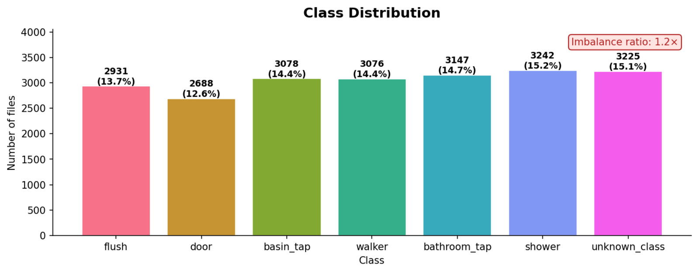
</p>

## Classes

| Class | Description | Acoustic characteristics | Commonly confused with |
|---|---|---|---|
| **Flush** | Toilet flushing | Transient onset, then broadband water flow | Bathroom Tap, Shower |
| **Shower** | Continuous shower water flow | Sustained broadband noise, stable energy | Bathroom Tap, Basin Tap |
| **Bathroom Tap** | Bathroom tap running | Continuous flow, variable intensity | Shower, Basin Tap |
| **Basin Tap** | Basin tap running | Continuous, narrow/localized flow | Bathroom Tap |
| **Door** | Opening / closing / knocking / latch | Impulsive onset, short duration | Walker/Crutch |
| **Walker/Crutch** | Mobility-aid contact sound | Repeated transient impacts separated by silence | Door, Unknown Class |
| **Unknown Class** | Background, silence, non-target events | Low-energy or mixed background, high variability | Door, distant tap |

The six target classes cover the majority of routine bathroom activity (water use,
access, and mobility events); the *Unknown Class* aggregates background/non-target sound
so a deployed classifier can reject out-of-distribution inputs during continuous
monitoring.

## Recording hardware & environments

Recordings were captured with a fully embedded platform built around a **Raspberry Pi
Zero 2 W** and a **Waveshare WM8960 audio HAT**, with an OLED status display, SD-card
storage, a UPS HAT for untethered operation, and four control switches (start/stop
recording, run inference, shut down, reserved). Capture, storage, and on-device
inference all run **offline** — a deliberate reproducibility and privacy choice.

| Property | Value |
|---|---|
| Compute platform | Raspberry Pi Zero 2 W (512 MB RAM) |
| Audio front-end | Waveshare WM8960 audio HAT |
| Sampling rate | 20 kHz |
| Bit depth | 32-bit I2S |
| Channels | Mono |
| Automatic gain control | Disabled |
| Microphone placement | Dynamic (not fixed) |
| Same device across all sites | No |

| ID | Location | Type |
|---|---|---|
| E01 | NIT Durgapur (CSE / Annex 1) | Institutional |
| E02 | Residential home, Howrah | Residential |
| E03 | Hall-6, NIT Durgapur | Hostel |
| E04 | DS-1B, NIT Durgapur | Residential |
| E05 | Hall-9, NIT Durgapur | Hostel |

Recordings were acquired independently per class per environment under naturally
occurring conditions (varying door state, ventilation, user position), stored as
uncompressed WAV, and quality-checked before annotation — segments with severe clipping,
interference, or hardware artifacts were discarded.

## Annotation & preprocessing

Each continuous recording was manually annotated and segmented into overlapping analysis
windows:

```
xᵢ = [s(iH), s(iH+1), …, s(iH+L-1)]
```

with `L = 30,225` samples (1.51125 s) and hop `H = 10,225` samples (0.51125 s) at 20 kHz.
During training, waveform-level amplitude augmentation (±25%, i.e. ×1.25 / ×0.75) was
applied to improve robustness to recording gain and microphone-placement variation.

## Dataset statistics

The final corpus contains 21,387 windows with a maximum class imbalance of only 1.2×
(largest: Shower, 3,242; smallest: Door, 2,688) — usable as-is or with light class
weighting.

| Class | Windows | Share |
|---|---:|---:|
| Flush | 2,931 | 13.7% |
| Door | 2,688 | 12.6% |
| Basin Tap | 3,078 | 14.4% |
| Walker/Crutch | 3,076 | 14.4% |
| Bathroom Tap | 3,147 | 14.7% |
| Shower | 3,242 | 15.2% |
| Unknown Class | 3,225 | 15.1% |
| **Total** | **21,387** | 100% |

### Per-class difficulty

A composite difficulty score (aggregating inter-class overlap, intra-class spread,
imbalance, silence content, and RMS variability, normalized to [0, 1]) characterizes the
corpus beyond raw counts. *Flush* is the hardest class (0.737) due to broadband overlap
with other water events; *Bathroom Tap* (0.251) and *Unknown Class* (0.242) are easiest.

<p align="center">
  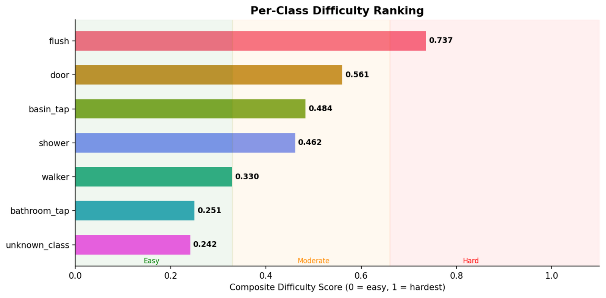
</p>
<p align="center">
  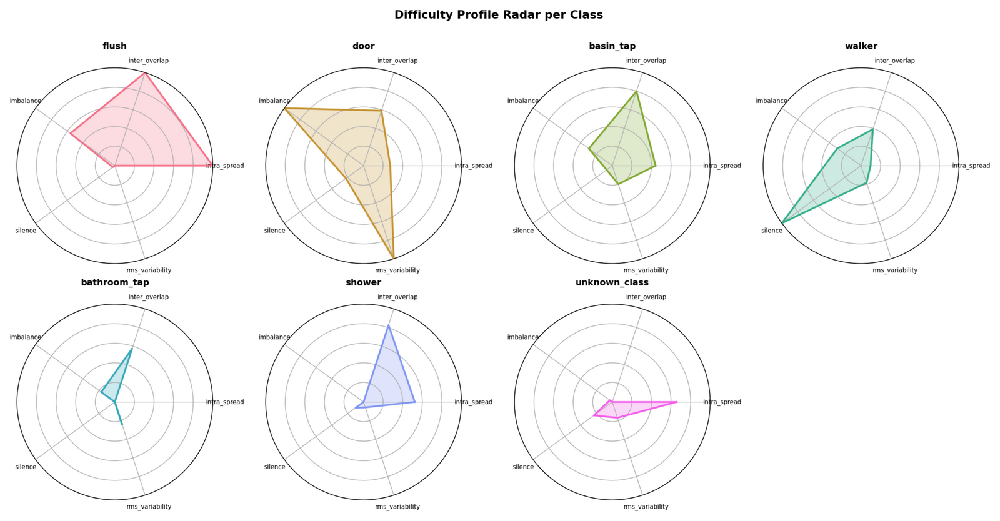
</p>
<p align="center">
  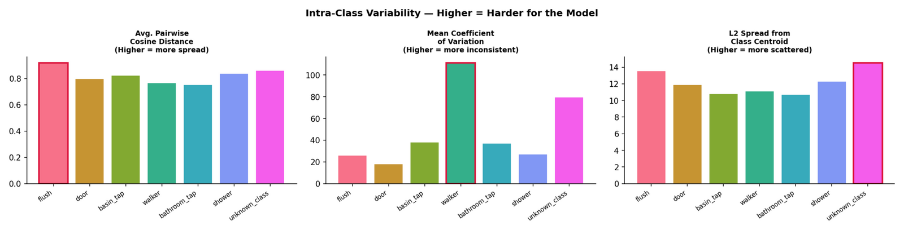
</p>
<p align="center">
  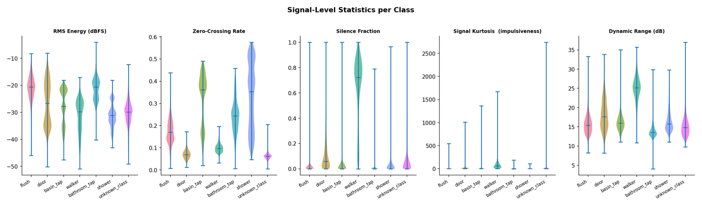
</p>

### Representative signal

<p align="center">
  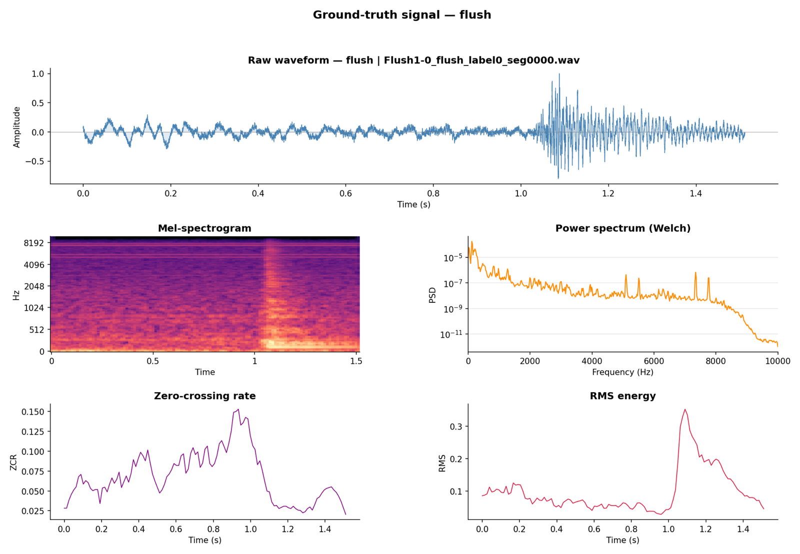
</p>

Water-related activities (Flush, Shower, Bathroom Tap, Basin Tap) show distinct temporal
energy patterns despite sharing broadband characteristics, while Door and Walker/Crutch
contain short impulsive/transient structure, and the Unknown Class shows the greatest
variability.

<p align="center">
  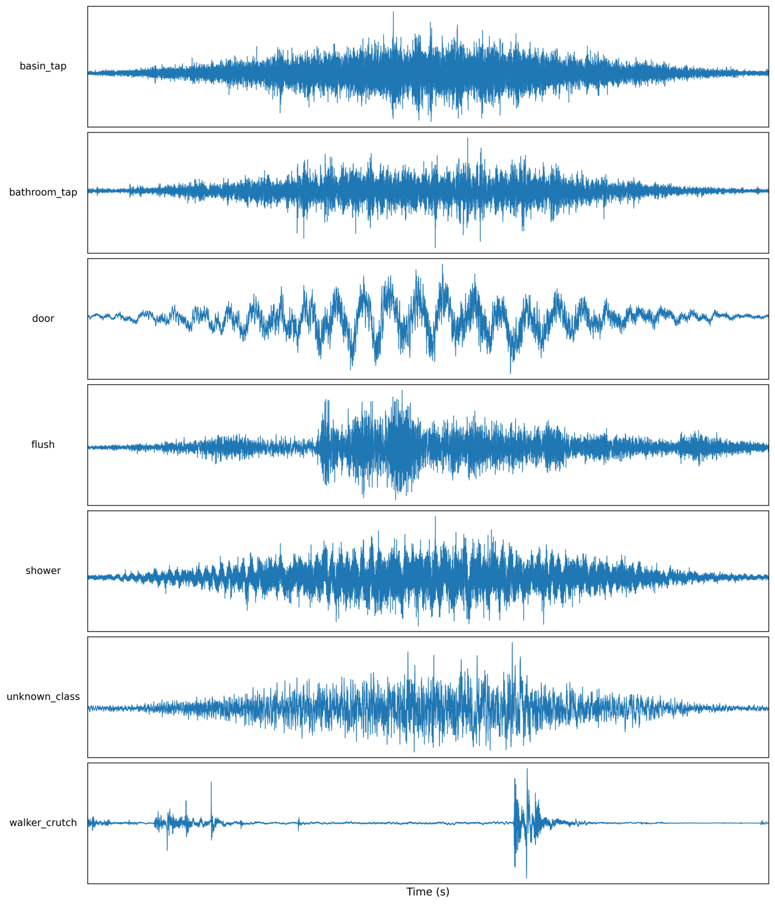
  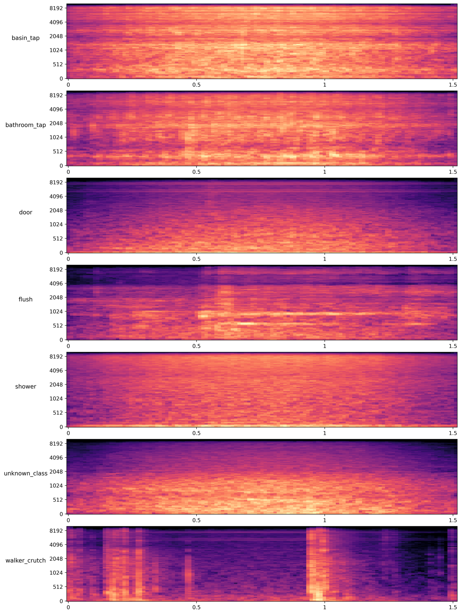
</p>

## Benchmark results

Seven representative acoustic event classification models were evaluated — three
MFCC-based (DS-CNN, CRNN, TinyCNN) and four raw-waveform models (ACLNet, DPNet, ACDNet,
SincNet) — trained with the Adam optimizer and categorical cross-entropy loss, with
waveform-level amplitude augmentation (±25%). All models exceed 93% accuracy; six exceed
96%.

| Model | Input | Params | Accuracy (%) | Inference (ms, PC) |
|---|---|---:|---:|---:|
| DS-CNN | MFCC | 81,863 | 97.59 | 39.52 |
| CRNN | MFCC | 128,519 | 98.80 | 39.13 |
| ACLNet | Raw | 146,240 | 96.82 | 61.12 |
| DPNet | Raw | 547,537 | 99.21 | 63.02 |
| TinyCNN | MFCC | 1,736,071 | 99.63 | 39.00 |
| **ACDNet** | Raw | 4,711,303 | **99.64** | 66.67 |
| SincNet | Raw | 14,149,895 | 93.76 | 52.00 |

**ACDNet** gives the best offline accuracy (99.64%); **DPNet** offers the best
accuracy/complexity trade-off for resource-constrained edge deployment.

### Edge deployment (Raspberry Pi Zero 2 W, quantized TFLite)

| Data | Model | Acc. (%) | Size | Real-time Acc. (%) | TFLite (ms) | End-to-end (ms) |
|---|---|---:|---:|---:|---:|---:|
| Original | ACDNet | 97.69 | 18.4 MB | 62.65 | 15.68 | 230.8 |
| Original | ACDNet + Prep. | 99.39 | 18.4 MB | 66.27 | 27.38 | 230.2 |
| Original | DPNet | 97.52 | 2.15 MB | 70.68 | 4.45 | 59.5 |
| +Augmented | ACDNet | 99.39 | 18.4 MB | 64.46 | 21.17 | 231.1 |
| +Augmented | ACDNet + Prep. | 99.64 | 18.4 MB | 80.99 | 27.61 | 230.0 |
| +Augmented | **DPNet** | 99.21 | **2.15 MB** | **89.26** | 15.71 | 53.5 |

After quantization, DPNet occupies only ~2.15 MB and achieves **89.26% real-time
accuracy** with ~15.7 ms average inference latency — supporting both high-performance
offline benchmarking and resource-constrained edge deployment.

### Error analysis

<p align="center">
  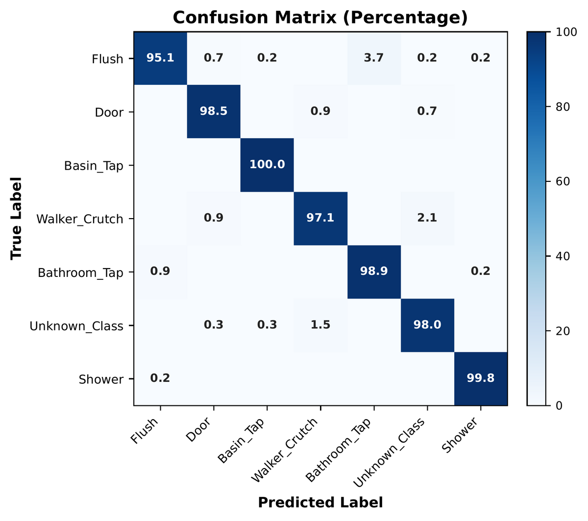
</p>

Most classes are recognized above 98%. The dominant confusion is between **Flush** and
**Bathroom Tap** (similar broadband water-flow characteristics), while **Basin Tap** is
recognized almost perfectly due to its more distinctive, localized acoustic signature —
consistent with the difficulty-score analysis above.

## Repository structure

```
SnaanGhar7/
├── README.md                 ← this file
├── LICENSE                   ← CC BY-NC 4.0
├── CITATION.cff              ← machine-readable citation
├── paper/
│   └── SnaanGhar7_paper.pdf  ← full paper (submitted version)
└── docs/                     ← GitHub Pages project site
    ├── index.html
    └── assets/
        ├── css/style.css
        └── img/               ← all figures used on the site & in this README
```

> **Note on the released audio/annotations:** this repository hosts the paper, project
> site, and benchmark documentation. The raw audio recordings, per-file annotations, and
> benchmark train/val/test splits are being packaged for release alongside the dataset
> DOI — see [Dataset availability](#dataset-availability) below for the current status
> and how to request early access.

## Dataset availability

| | |
|---|---|
| **Repository** | https://github.com/debolina-34/SnaanGhar7 |
| **Project page** | https://debolina-34.github.io/SnaanGhar7/ |
| **DOI** | To be assigned upon publication |
| **License** | [CC BY-NC 4.0](LICENSE) |
| **Version** | v1.0 |
| **Contact** | debolinarimuchowdhury@gmail.com |

## Privacy & ethical considerations

SnaanGhar7 relies exclusively on **passive acoustic sensing**, not cameras, and supports
only activity-level acoustic event classification — it is **not** designed or intended
for speech recognition, speaker identification, user authentication, or personal
attribute inference. All recordings were collected with informed participant consent and
permission from the respective property owners. A small number of Unknown Class
recordings contain incidental human speech captured under realistic conditions; these are
treated solely as non-target events, and no personally identifiable information is
included in the released dataset. The dataset is released **exclusively for academic
research** in privacy-preserving acoustic sensing, AAL, healthcare monitoring, and
TinyML.

## Limitations

SnaanGhar7 currently covers seven classes from five bathroom environments collected with
a single recording platform, so it does not capture the full diversity of bathroom
layouts, devices, or user behaviors encountered in practice. Only isolated events are
annotated (no overlapping/simultaneous activity labels), and — while the benchmark is
intentionally near-balanced for fair model comparison — real deployments are typically
far more imbalanced. Future releases aim to expand recording environments, participants,
devices, and event categories.

## Citation

If you use SnaanGhar7 in your research, please cite:

```bibtex
@inproceedings{chowdhury2026snaanghar7,
  title     = {{SnaanGhar7}: A Real-World Bathroom Acoustic Event Dataset for
               Privacy-Preserving Assistive Living},
  author    = {Chowdhury, Debolina and Samui, Suman and Saha, Sujoy},
  year      = {2026},
  note      = {Dataset paper. Version v1.0},
  url       = {https://github.com/debolina-34/SnaanGhar7}
}
```

See also [`CITATION.cff`](CITATION.cff).

## Acknowledgements

Collected at NIT Durgapur across residential, hostel, and institutional bathroom
environments. We thank all participants who consented to data collection and the
property owners who permitted recording.
